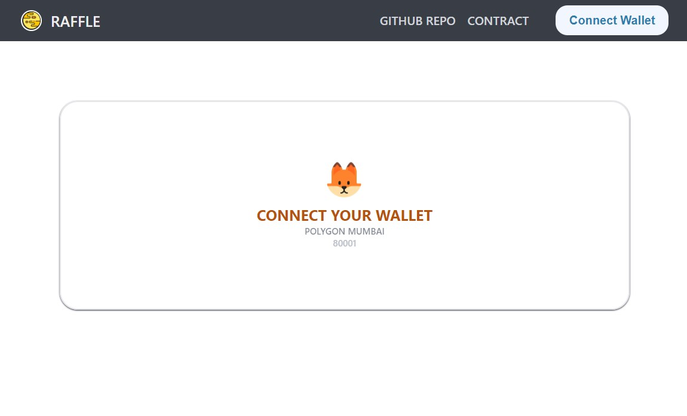
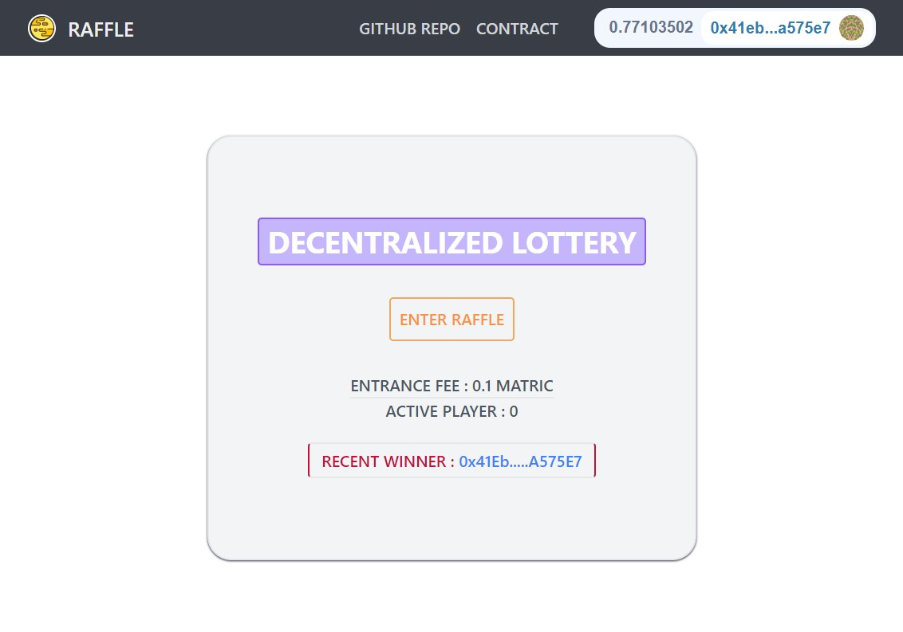

# RAFFLE
## Decentralized Lottery Application

### Preview
<p align="center">
<a href=""></a>
<br><br>
<a href=""></a>
</p>

----

### TECH USED

- NEXT JS
- Tailwind CSS
- Moralis
- Web3uikit
- IPPS

- Dependecies:
  - Node.js  
  - Metamask / Any other-EVM-Wallet
---
### ABOUT

- Created by [Subroto Kumar](htpps://bio.link/subroto)
- Smart Contract
  - Raffle.sol deployed at [*0x49A0113C34e568a69993dc91D5386B2Eca0fcf49*](https://mumbai.polygonscan.com/address/0x49A0113C34e568a69993dc91D5386B2Eca0fcf49)
  - Blockchain Network : **Polygon Mumbai**
  - Chain Id: `80001`
- Frontend
  - Deploy to **IPFS** using **Fleek**

---

### Ouickstart

```bash
git clone https://github.com/subrotokumar/decentralized-lottery.git
cd decentralized-lottery
yarn
yarn dev
```